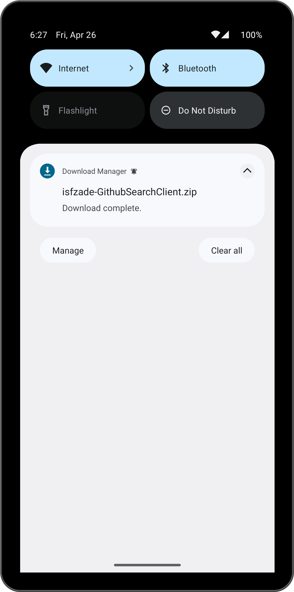
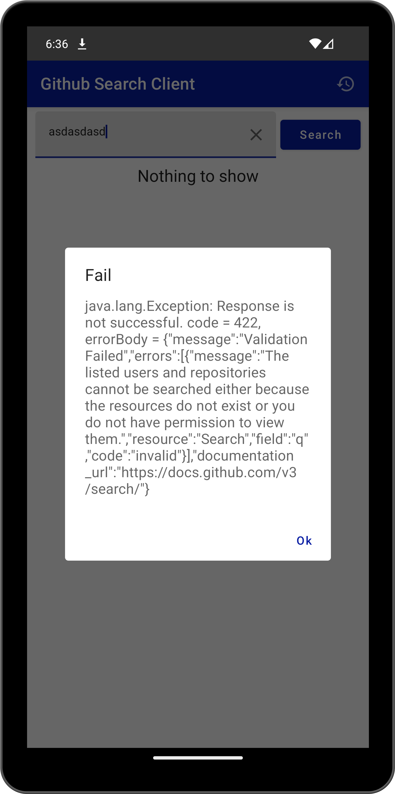
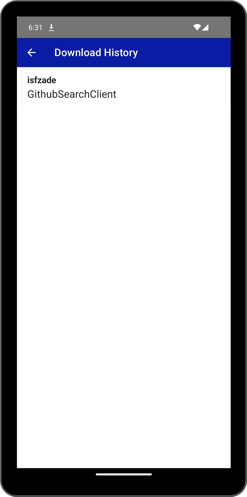

# GitHub Search Client
## Introduction
Github Search Client is an Android Application which developed by using Kotlin and Jetpack Compose.
Using this application a user can search repositories by using author name.
Also, the application gives possibility to download repository to a device.

The application was developed by Isfandiyar Rashidzade.

### Search
Search screen is composed of a text field, search button and list of results.

Each result contains avatar of author, author name, repository name and repository description.
It is possible to download the repository by clicking download button or review the repository on browser by clicking the cursor button.

When download is finished a notification received about the downloaded repository.

If no result detected or any error obtained an alert dialog is displayed.

### Download History
Download History screen shows the downloaded repositories as list.

### Tools
In this project different Android tools were used.
- `Room`: It is used to store download history
- `Retrofit`: This library is used to send API request to GitHub for searching.
- `Coil`: This implementation is for displaying the image of repository author.
- `Splash`: In order to show the logo of the application when app is started.
- `Hilt`: This is very common library to inject the dependencies to view models.
- `Compose Navigation`: It is used for navigate between search and history screens.

### Tools
You can download APK from here: [click to download](./app-debug.apk)